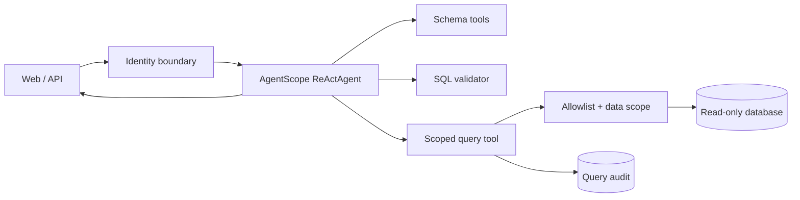

# Qiqi DataAgent

Qiqi DataAgent 是一个基于 AgentScope Java 的数据分析智能体。用户用自然语言提问，Agent 会查看真实表结构、生成并校验只读 SQL、按服务端身份施加数据范围、执行查询，再输出带 `queryId` 证据的分析结果。

这个仓库是独立项目，拥有自己的构建、示例数据、测试和 Git 历史。代码、提示词、页面和销售示例数据均为本项目重新设计.
## 当前可运行能力

- AgentScope Java 2.0.3 ReAct 循环与 DashScope 流式模型。
- 表清单和真实 JDBC 元数据探查工具。
- 单条只读 SQL 校验、表白名单、危险函数拦截和强制 `LIMIT`。
- 服务端身份绑定；模型不能通过工具参数指定或伪造用户身份。
- `ALL` 和 `DEPARTMENT` 两种数据范围；订单行必须通过订单主表的合法关联接受部门约束。
- JDBC 查询超时、最大行数和只读连接标记。
- 查询审计：记录 `queryId`、用户、会话、最终 SQL、耗时和执行状态。
- 图表 MCP：基于最终选定的查询证据生成柱状图、折线图、饼图，支持 PNG / MinIO 链接、终态展示、历史回放和报告导出。
- TodoWrite 计划面板：复杂任务先规划、逐步更新状态，失败/取消保留未完成项。
- 原生 data-analysis Skill 按需加载，规定数据口径、查询验证、图表与证据报告工作流。
- 结果优先分析卡片：运行中展示中文业务说明和计划进度，工具调用收进可折叠的技术记录；完成后优先展示结论、图表和报告。
- SSE 流式接口和一个无前端构建依赖的聊天页面。
- 响应式分析工作台：流式 Markdown 报告、可横向滚动的表格、SQL 复制、报告下载和查询证据。
- 支持快捷问题、停止生成、新建分析和历史切换；不同对话可同时生成，后台完成后显示新回复提示。
- 停止按钮仅影响当前对话；删除生成中的对话会停止其请求。请求进行期间暂不切换演示身份。
- 原创 H2 销售数据，开箱即可验证 SQL、安全策略和部门隔离。

当前身份入口 `X-Qiqi-User` 是本地演示适配器，用来验证 Agent 运行时身份传播，不是生产登录方案。公开部署前必须替换成 SSO、JWT 或企业网关认证，并为业务库配置数据库级只读账号。

## 架构



`ReActAgent` 按请求创建，避免共享可变运行状态；会话状态存储由应用共享，并以服务端确认的 `userId + sessionId` 隔离。同步 JDBC 工具在 Reactor 的弹性线程池执行，不阻塞 WebFlux 事件线程。

## 跟着项目学习 AgentScope 2.0

学习时先不要通读整个框架。第一课从一条真实请求入手，只看 Agent 的创建、`RuntimeContext` 和工具交接：

- [第一课：一次请求怎样进入 AgentScope](docs/learning/01-agent-runtime-entry.md)

## 本地运行

要求：JDK 21、Maven 3.9+、一个 DashScope API Key。

```bash
export DASHSCOPE_API_KEY="your-key"
mvn spring-boot:run
```

访问 [http://localhost:8080](http://localhost:8080)。可以切换三个演示身份：

| 用户 | 数据范围 | 用途 |
| --- | --- | --- |
| `admin` | 全部数据 | 查看完整结果 |
| `alice` | North Sales（部门 10） | 验证北区过滤 |
| `bob` | South Sales（部门 20） | 验证南区过滤 |

建议问题：

```text
对比 2026 年 1 月和 2 月已付款收入，并按部门解释变化，给出查询证据。
```

没有 API Key 时应用仍可启动，页面、数据和自动化测试可用；聊天接口会返回清楚的配置错误。

### 使用 OpenAI 兼容网关

在项目根目录创建 `application-local.yml`（已被 Git 忽略），填写网关配置：

```yaml
qiqi:
  model:
    provider: openai
    base-url: https://your-gateway.example/v1
    api-key: "your-key"
    name: your-model-id
```

通过 `mvn spring-boot:run -Dspring-boot.run.profiles=local` 加载该配置。
也可使用 `QIQI_MODEL_PROVIDER`、`QIQI_MODEL_BASE_URL`、`QIQI_MODEL_API_KEY` 和
`QIQI_MODEL` 环境变量。默认仍使用 DashScope；兼容网关使用 Bearer 认证，
模型 ID 以网关的模型列表为准，需支持流式回复和工具调用。不要提交真实密钥。

## 图表 MCP

使用 [mcp-echarts 0.7.1](https://github.com/hustcc/mcp-echarts/tree/0.7.1)，通过 AgentScope 原生 MCP 客户端连接 Streamable HTTP 服务。Node.js 18+，先在独立终端启动：

```bash
npx -y mcp-echarts@0.7.1 -t streamable -p 3033
```

在运行 Qiqi 的终端启用图表（仍需按上文配置模型）：

```bash
export QIQI_CHART_ENABLED=true
export QIQI_CHART_MCP_URL=http://localhost:3033/mcp
mvn spring-boot:run
```

使用本地模型配置文件时在启动命令追加 `-Dspring-boot.run.profiles=local`。
也可以在 `application-local.yml` 的已有 `qiqi` 节点下增加：

```yaml
qiqi:
  chart:
    enabled: true
    mcp-url: http://localhost:3033/mcp
    timeout: 30s
```

示例问题：“统计各部门已付款收入并画柱状图，给出查询证据”；随后可追问“把刚才的结果改成饼图”。

模型调用 `generate_chart(queryId, type, categoryColumn, valueColumn, title)`。服务端按当前用户和会话取得真实查询结果，构造 ECharts 配置，再调用 MCP 的 `generate_echarts`。模型不能自行提交数据、用户 ID 或 MCP 地址。图表结果通过工具事件的 `metadata.chart` 送给前端，模型只接收简短结果说明，避免把图片 Base64 放入模型文本上下文。

- 默认关闭，开启后按需连接；图表服务没启动不会阻止 Qiqi 启动或普通查数。调用失败在技术记录中说明并允许 Agent 继续解释数据。
- 每次调用独立 MCP 会话，完成、失败或取消后关闭；默认调用超时 30 秒，握手超时 5 秒。
- 首版支持一个分组列和一个数值列，1–100 行、分组唯一。截断结果、非数值、缺失值、负值饼图会被拒绝，需先调整 SQL。
- 查询证据按用户和会话落盘；内存缓存保留 30 分钟、最多 200 条，缓存淘汰或重启后会读取磁盘快照。
- 未配 MinIO 时直接显示 PNG，可下载和导出到 Markdown；配了 MinIO 时显示服务返回的图片链接。链接过期会提示重新生成。MinIO 服务本身需单独配置。
- PNG 与图表元数据保存在服务端，页面使用带身份校验的图表接口读取；单张 PNG 上限 1.5 MB。Markdown 导出会嵌入本地 PNG，避免导出后依赖应用鉴权。MinIO 图片保存外部引用，其保留期与签名过期由对象存储负责。

真实 MCP 集成测试（无需模型 Key，Agent 决策使用测试脚本）：

```bash
# 先启动上面的 MCP 服务，再运行
QIQI_LIVE_CHART_TEST=true QIQI_CHART_TEST_URL=http://localhost:3033/mcp mvn test
```

它实际执行 H2 查询、运行 AgentScope 工具循环、调用 MCP 生成三种图片，并校验 SSE 图表元数据。普通 `mvn test` 不需要 MCP 服务。MinIO 链接的解析有单测，尚未做真实 MinIO 上传联调。

下一阶段的现状与建议见 [增强路线讨论](docs/enhancement-roadmap.md)。

## 本地工作区、运行控制与文件分析

默认把数据保存到项目的 `.qiqi/`（已加入 Git 忽略），可通过 `QIQI_STORAGE_DIR` 指定专用持久卷。
目录包含 Agent 状态、历史、查询快照、PNG、CSV 文件和运行记录。**这是单机文件存储方案**；多进程或多副本部署需要共享数据库/对象存储与分布式锁。
业务演示数据库仍是内存 H2；保留工作区只会保存分析上下文和结果，不会持久化或备份业务源表。

- 一次请求生成一个 `runId`，SSE 增加 `RUN_START` / `RUN_END`；运行详情包含阶段耗时（含工具调度）、失败代码和模型提供的 Token 用量。未提供用量时显示未知，不虚构成本。
- 同一用户、同一会话同时只允许运行一个请求，冲突返回 409。停止按钮调用服务端取消，再断开 SSE；断开连接同样触发取消。取消传递给 Agent、响应订阅与 JDBC `Statement.cancel()`，驱动仍受原查询超时约束。
- `GET /api/runs/{runId}` 查看记录；`POST /api/runs/{runId}/cancel` 停止运行，均需 `X-Qiqi-User`。重启遗留的 RUNNING 记录读取为 INCOMPLETE / SERVER_RESTART。
- 页面“继续完成”会沿用会话并重新发起剩余任务；不自动重放未完成工具。当前工具均为只读能力。进程中断前的未保存模型片段不会加入 Agent 上下文；查询证据已独立保存。
- “上传 CSV”支持 UTF-8、2 MB、5000 数据行、50 列、每单元格 10000 字符，支持引号、逗号和单元格内换行。上传内容仅能由同一用户、同一会话读取。
- `analyze_file` 支持前 20 行预览，以及对完整文件 count / sum / avg / min / max，可按一列分组（最多 100 组）。空数值单元格不参与数值聚合；非数值内容明确拒绝，避免错误自动转换。当前不支持 XLSX、任意 Python/SQL 或大文件。
- 聚合返回 `category`、`value` 和 `queryId`，可直接画图。查询证据提供 CSV 下载，截断数据明确标记“导出预览”；文本公式前缀做转义，数值保持数值。Markdown 报告仍可下载。
- 历史单用户最多 100 会话、5 MB；超限保留浏览器内容并提示服务端保存失败。删除历史只移除会话列表，工作区证据暂时保留。磁盘留存与清理策略尚未自动化。

## 工具发现与联网搜索

保留 ReActAgent，启用原生 `reset_equipped_tools`：基础 SQL 与 `todoWrite` 常驻；`generate_chart` 在 `QIQI_CHART_ENABLED=true` 时同样常驻。`files` / `web` 按需激活；web 组只在本次请求允许联网且搜索已配置时注册。分析请求必须先写计划；模型核对完口径和证据后，从最终选定的 `queryId` 自动出图，不向用户确认。图表产物在运行终态前只缓存、不展示。

```bash
export QIQI_WEB_SEARCH_ENABLED=true
export TAVILY_API_KEY='your-key'
# 然后启动应用，在输入框勾选“联网搜索”
```

搜索调用 [Tavily Search API](https://docs.tavily.com/documentation/api-reference/endpoint/search)，每轮最多 3 次，每次最多 5 条来源；默认 15 秒超时、不自动重试。
关键词会发送给 Tavily；请求不会自动附带会话历史、数据库行或附件内容。工具提示要求只用公开关键词；这不是通用敏感内容识别器。
服务端同时检查每轮授权、当前用户和调用预算；不能通过模型参数开启联网。开关在发送后复位，不继承上一轮权限。
返回来源标题、链接、摘要与检索时间，页面和报告保留来源链接。鉴权失败、限流、超时都有稳定故障代码；诊断记录不存模型提示词、SQL、工具入参或供应商原始错误正文。
展示详情单独保存到执行记录，包含有界、脱敏的参数和结果摘要；不保存原始分片、模型内部推理或额外的明细行。
目前接入内置 ClasspathSkillRepository；未实现用户上传 Skills 管理、网页任意抓取、OpenTelemetry 导出或价格换算。

## API

流式聊天：

```bash
curl -N http://localhost:8080/api/chat/stream \
  -H 'Content-Type: application/json' \
  -H 'X-Qiqi-User: alice' \
  -d '{"query":"统计每月已付款收入","conversationId":"demo-1"}'
```

运行信息与演示用户：

```bash
curl http://localhost:8080/api/meta
```

## 验证

```bash
mvn test
```

前端回归检查（Node.js 22.13+；仅测试需要，运行应用无需 Node.js）：

```bash
npm --prefix src/test/frontend ci
npm --prefix src/test/frontend test
```

覆盖 Markdown 表格和代码块、HTML 清理、跨分片 UTF-8/SSE、查询证据、身份切换、
网络错误、连接中断、停止生成和重复提交。Markdown 依赖随项目本地分发，不依赖运行时 CDN。
对话历史保存到服务端并在浏览器缓存，按演示身份隔离；历史写入带版本号，跨标签页冲突返回 409，避免静默覆盖。旧浏览器记录在首次连接空服务端历史时迁移。
Agent 上下文使用 `JsonFileAgentStateStore`；重启后可继续最近已保存的会话。未完成的一轮从上次已保存上下文继续，不承诺接续到某个 Token。

测试覆盖以下边界：

- DML、多语句、注释、锁、未公开表和危险函数拒绝。
- 直接、嵌套和 CTE 查询的部门条件注入。
- 订单明细绕过、笛卡尔关联和带 `OR` 的放宽关联拒绝。
- 同一聚合在管理员、北区、南区身份下返回不同且确定的结果。
- 未知身份在 Agent 运行前拒绝。
- 未配置模型密钥时应用仍能启动和提供静态页面。

## 执行过程与恢复

复杂分析先生成 Todo，使用 `load_skill_through_path` 加载内置 `data-analysis/SKILL.md`。
参数和结果通过 `EXECUTION_UPDATE` 规范化后进入折叠的技术执行记录；失败项自动展开，成功项保持紧凑，可查看 SQL/参数、结果摘要及耗时。用户可见的过程说明来自脱敏后的 `TEXT_BLOCK_DELTA`，原始 thinking 不进入页面或恢复快照。
工具参数须完整接收后才能安全展示；敏感字段与 SQL 字面值脱敏，长结果截断，完整查询结果仍通过有权限的证据接口读取/导出。

`GET /api/runs/{runId}/execution` 按用户读取版本化的执行快照。运行中定期保存，在工具边界和终止时保存；
刷新后按运行状态恢复计划、中文过程说明、折叠工具记录、报告、证据和图表引用；运行中不会提前展示图表。若原运行仍在结束，页面短暂轮询状态；服务重启后的进行中记录标为未完成。
旧历史继续显示已有文本。该机制恢复展示与已保存上下文，不重新执行工具，也不承诺 Token 级断点续传。

验收记录见 [执行体验增强](docs/execution-enhancements.md)。

## 配置

主要配置在 `src/main/resources/application.yml`：

| 配置 | 默认值 | 说明 |
| --- | --- | --- |
| `QIQI_STORAGE_DIR` | `.qiqi` | 专用本地工作区目录 |
| `QIQI_WEB_SEARCH_ENABLED` | `false` | 启用可选联网搜索 |
| `TAVILY_API_KEY` | 空 | 搜索服务密钥，仅服务端使用 |
| `DASHSCOPE_API_KEY` | 空 | DashScope 模型密钥 |
| `QIQI_MODEL` | `qwen-plus` | 模型名 |
| `QIQI_MAX_ITERATIONS` / `qiqi.model.max-iterations` | `40` | 单次 ReAct 最大迭代，上限 100；到达上限保留计划和证据 |
| `QIQI_RUN_TIMEOUT` / `qiqi.model.run-timeout` | `10m` | 单次总时限，最大 30m；另保留 2m 无事件超时 |
| `qiqi.query.max-rows` | `200` | 查询结果硬上限 |
| `qiqi.query.timeout` | `10s` | JDBC 查询超时 |
| `qiqi.exposed-tables` | 五张示例业务表 | Agent 可见表白名单 |

接真实数据库时，覆盖 `spring.datasource.*`，关闭示例初始化，并维护表白名单：

```yaml
spring:
  sql:
    init:
      mode: never
  datasource:
    url: jdbc:mysql://localhost:3306/your_database
    username: qiqi_readonly
    password: ${QIQI_DB_PASSWORD}
```

当前部门范围规则针对示例订单模型：事实表是 `sales_order`，明细表是 `sales_order_item`。接入其他业务模型前，应为新事实表实现明确的范围规则和绕过测试，不能仅把表名加入白名单。

## 后续路线

第一阶段已经建立独立、可运行的安全查数闭环。本轮已补单机会话/证据持久化、运行控制、CSV 分析与联网观测，以及 Todo、Skills 和可恢复执行时间线；后续优先补受版本管理的业务指标口径，再评估分布式部署，详见增强路线讨论。原始规划如下：

1. 持久化会话、中断与恢复、稳定的前端事件协议。
2. 业务术语和指标层，避免同一指标出现多种 SQL 口径。
3. 文件上传、小文件直读、大文件 RAG 与图片理解。
4. MCP 联网、Skills 管理与图表增强（基础图表 MCP 已接入）。
5. 正式认证、角色和部门管理、PostgreSQL/MySQL 数据范围适配。
6. 可观测性和参赛演示报告。

Agent 自动评分和 BIRD 数据集评测暂不在当前范围；安全与功能回归测试会持续保留。

## 公开发布

仓库使用 [Apache License 2.0](LICENSE)。提交 GitHub 前请确认历史中没有 API Key、真实数据库地址、公司数据或课程受限资源。项目依赖 [AgentScope Java](https://github.com/agentscope-ai/agentscope-java)、Spring Boot、JSqlParser、H2 等第三方开源组件，各自遵循其许可证。

## GitHub Pages 交互演示

`python scripts/build-demo.py` 生成 `target/pages-demo/`，可用静态服务器预览。
该目录仅包含前端和固定模拟回答，不复制本地配置、不访问模型或数据库。
默认白色/雾青绿主题、流式 Markdown、停止生成及本地历史均可体验；演示历史与正式版分开保存。

发布时将生成目录的内容推送到 `gh-pages` 分支，并在仓库 Settings → Pages
选择 Deploy from a branch → gh-pages → /(root)。更新演示时重新生成并推送该分支。
构建输出使用相对资源路径，兼容 GitHub Pages 的 `/noman/` 子路径。

### 本机设置页

设置采用独立分类导航：外观、AI 模型与 Key、数据库。
外观与打字效果立即生效，保存在浏览器；模型连接和查询限制写入项目根目录
`application-local.properties`，使用 `local` profile 重启服务后生效。
该文件已被 Git 忽略，权限为仅文件所有者可读写。配置优先于同目录的
`application-local.yml`；Key 留空保留原值，接口不返回 Key。
管理接口仅在 `local` profile 启用，要求本机请求和同源访问。

数据库页展示当前连接，并允许调整最大返回行数（1–1000）和查询超时（1–60 秒）。
本次不提供更换数据库连接：外部数据库需要先分离系统身份/审计库与业务库，并适配权限。
静态演示版的模型与数据库表单禁用，不收集凭据。
